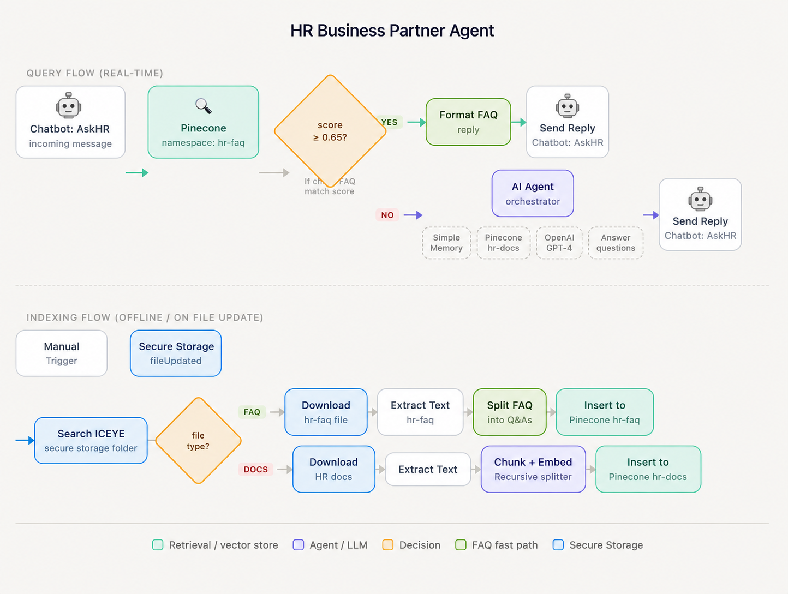
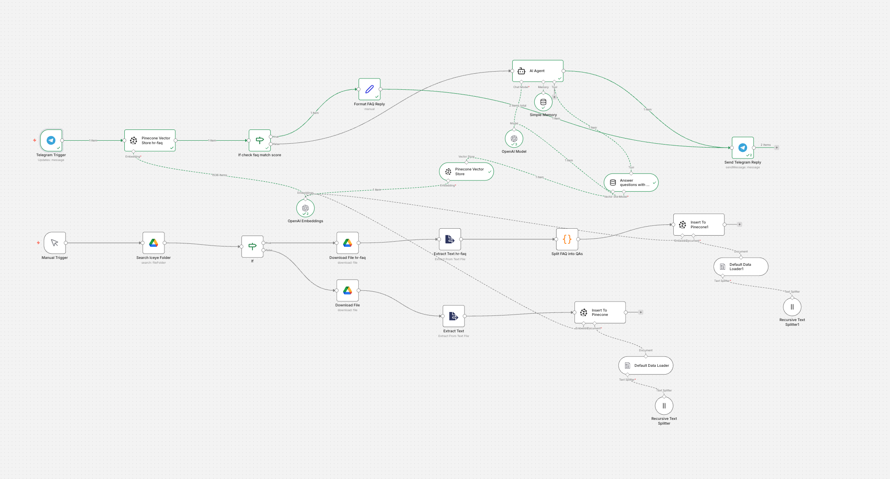

# Virtual HR Business Partner Agent

A conversational AI agent that supports employees with day-to-day HR needs — answering questions on holidays, benefits, and career development, and providing basic coaching on performance conversations.

---

## Overview

HR information is distributed across multiple internal sources (Confluence, Google Drive, policy documents, HR systems). This agent retrieves all docs from Google Drive and combines insights from these sources to deliver accurate, context-aware responses via Telegram.

The system uses a **hybrid retrieval approach**:

- **FAQ fast path** — 80% of common questions are answered directly from a pre-indexed FAQ store, without invoking the LLM. This improves response speed, reduces cost, and lowers the risk of hallucination.
- **Full RAG pipeline** — less common or more complex questions are routed to an AI Agent that retrieves relevant chunks from the full HR document store and generates a grounded response.

---

## Architecture





```
QUERY FLOW (real-time)

Telegram message
       ↓
Pinecone vector search (namespace: hr-faq)
       ↓
Score ≥ 0.65?
  ├── YES → Format FAQ reply → Send Telegram reply
  └── NO  → AI Agent (Simple Memory + Pinecone hr-docs + OpenAI GPT-4)
                  ↓
             Answer questions with RAG
                  ↓
             Send Telegram reply

INDEXING FLOW (offline / triggered on file update)

Manual Trigger / Google Drive fileUpdated
       ↓
Search ICEYE Google Drive folder
       ↓
File type?
  ├── FAQ  → Download → Extract text → Split into Q&A pairs → Insert to Pinecone (hr-faq)
  └── DOCS → Download → Extract text → Recursive Text Splitter → Insert to Pinecone (hr-docs)
```

---

## Key Components

| Component              | Tool                    | Purpose                                             |
| ---------------------- | ----------------------- | --------------------------------------------------- |
| Workflow orchestration | n8n                     | Connects all components, handles routing logic      |
| Vector database        | Pinecone                | Stores and retrieves embeddings for FAQ and HR docs |
| Embeddings             | OpenAI text-embedding-3 | Converts text to semantic vectors                   |
| LLM                    | OpenAI GPT-4            | Generates grounded answers from retrieved context   |
| Session memory         | n8n Simple Memory       | Maintains conversation context within a session     |
| Chat interface         | Telegram Bot            | Employee-facing interface                           |
| Document source        | Google Drive            | Stores HR policy documents and FAQ file             |

---

## Knowledge Base

The agent is trained on four HR documents:

- `leave_policy.txt` — Annual leave, sick leave, parental leave, bereavement leave, study leave
- `benefits google doc` — Healthcare, learning budget, remote work policy, lunch and commuting benefits
- `career.txt` — Performance review cycle, career levels, promotion process, coaching guidance
- `hr_faq google doc` — 35 pre-written Q&A pairs covering the most common HR questions

---

## Design Decisions

**Why hybrid retrieval?**
Most HR questions are repetitive and well-defined (e.g. "how many days of annual leave do I get?"). Pre-indexing these as Q&A pairs means the system can return verified answers instantly, without LLM inference. Only ambiguous or compound questions need the full RAG pipeline.

**Why separate Pinecone namespaces?**
FAQ documents and HR policy documents require different retrieval strategies. FAQ pairs are short and self-contained — a high similarity score to a FAQ chunk is a strong signal. Policy documents are longer and benefit from chunk-level retrieval with context. Separating namespaces avoids interference between the two retrieval modes.

**Why 0.65 as the FAQ score threshold?**
A threshold of 0.65 balances precision and recall for this use case. Below this value, the question is too different from any FAQ entry to trust a direct answer. Above it, the semantic match is strong enough that the FAQ answer is likely correct. This value should be tuned based on observed failures during evaluation.

**Why n8n for orchestration?**
n8n enables rapid prototyping of the full pipeline without sacrificing architectural clarity. Each node in the workflow corresponds directly to a component in the system design. For a production implementation, the same architecture would be replicated in TypeScript using LangChain, with proper error handling, retries, and observability.

**Escalation behaviour**
The system prompt instructs the agent to escalate to a human HR Business Partner for sensitive topics (disciplinary, termination, mental health). The agent should never fabricate a policy it cannot find in the knowledge base.

---

## What Is Out of Scope

- **Personalized employee data** — the agent does not access leave balances, salary data, or personal HR records.
- **Authentication and authorization** — the prototype does not include SSO or role-based access control.
- **Sensitive HR case decisions** — the agent does not make final judgments on harassment, discrimination, disciplinary action, or termination-related issues.
- **Live HR system integrations** — the prototype does not connect to Human Resources Information System (HRIS) or workflow systems.
- **Production-grade logging and compliance** — observability and auditability are considered, but not fully implemented.
- **Multi-language support** — the knowledge base is in English only.

---

## Implementation Challenges & Mitigations

### 1. System Efficiency (FAQ-first Routing)

**Challenge:** Not every employee query requires the full agentic RAG pipeline. Running full retrieval and generation for all queries increases latency and cost, and may introduce unnecessary complexity for simple, repetitive HR questions such as holiday policy or basic benefits.

**Mitigation:** I designed a FAQ-first routing strategy. The system first checks whether the user’s question closely matches a high-confidence FAQ entry. If so, it returns a direct answer immediately. Only queries that fall outside this high-confidence FAQ path are passed to the full RAG pipeline.

```
User Query
   ↓
FAQ Retrieval (Pinecone)
   ↓
High similarity?
   ├─ YES → Direct FAQ response
   └─ NO  → Full RAG (AI Agent)
```

This reduced latency, lowered API cost, and also lowers the chance of over-generating on simple policy questions.

Prototype scope: FAQ-first routing with similarity-based decision logic.

Production next step: Add monitoring for FAQ hit rate, fallback rate, and answer quality over time.

---

### 2. Confidence Thresholds and Incorrect Answers

**Challenge:** Vector similarity scores for relevant queries were often in the 0.6–0.7 range, while the initial threshold (0.88) was too high, blocking valid FAQ matches.

**Mitigation:** Analyzed score distribution empirically and adjusted the threshold to ~0.65, allowing flexible tuning based on observed performance. This increased FAQ hit rate without significantly introducing false positives.

---

### 3. Stale Policy Content and Version Conflicts

**Challenge:** HR information changes over time. If the system retrieves outdated versionsor conflicting documents, it may produce inaccurate guidance.

**Mitigation:** Used namespace clearing (`Clear Namespace`) during re-ingestion and introduced a clean data lifecycle strategy (full rebuild vs. incremental updates). This eliminated legacy data contamination and stabilized retrieval behavior.

Prototype scope: Clean rebuild strategy and controlled namespace resets to ensure index correctness.

Production next step: Add metadata such as updated_at, source name, and version number, plus file update triggers and conflict-aware ranking.

---


### 4. Privacy and Access Control

**Challenge:** HR systems often contain information with different access levels. Without proper access control, an HR assistant could expose sensitive documents or provide answers based on data the user should not access.

**Mitigation:** For this prototype, I intentionally limited the scope to general HR guidance and shared policy content.

Prototype scope: General policy assistant only; no personal HR records or role-specific confidential content.

Production next step: Integrate SSO, role-based access control, and audited API calls so answers are filtered based on user identity and permissions.

---

### 5. Sensitive Topics and Human Escalation

**Challenge:** Some employee questions go beyond policy retrieval and enter areas where AI should not make the final judgment, such as harassment, disciplinary actions, termination-related concerns, discrimination complaints, or mental health situations.

**Mitigation:** For this prototype, I define clear escalation boundaries for the assistant. The agent can only provide general process guidance or coaching support.


Prototype scope: Rule-based escalation for clearly sensitive categories.

Production next step: Add topic classification, escalation logging, and response templates that clearly communicate boundaries.

---

### 6. Observability and Auditability

**Challenge:** With observability, it's possible to understand why a specific answer was produced and whether the system behaved appropriately, which is important for debugging and improving the system. With auditability, it is possible review what the assistant retrieved, answered, or escalated.

**Mitigation:** Tracing is an important part of a production-ready design. Key events should be logged, including:

- User query
- FAQ match (or not)
- Retrieved document IDs and similarity scores
- Final generated answer
- Escalation decisions

Prototype scope: Conceptual logging design and evaluation-oriented tracing. 

Production next step: Add structured logs, trace IDs, retrieval traces, and escalation/audit records.

---

## Evaluation

The agent can be evaluated on three dimensions:

**Faithfulness** — Does the answer reference only information present in the retrieved documents? Hallucinated policy details are the primary failure mode.

**Answer relevance** — Does the answer actually address what the employee asked? Partial answers (missing a key condition) count as failures.

**Escalation rate** — What proportion of questions does the agent escalate to human HR? Too high means the knowledge base is insufficient. Too low means the agent may be overreaching on sensitive topics.

A set of 10 test cases is included in `hr_agent_test_cases.txt`, covering simple fact retrieval, multi-condition queries, cross-document retrieval, coaching questions, boundary conditions, and out-of-scope escalation.

---
